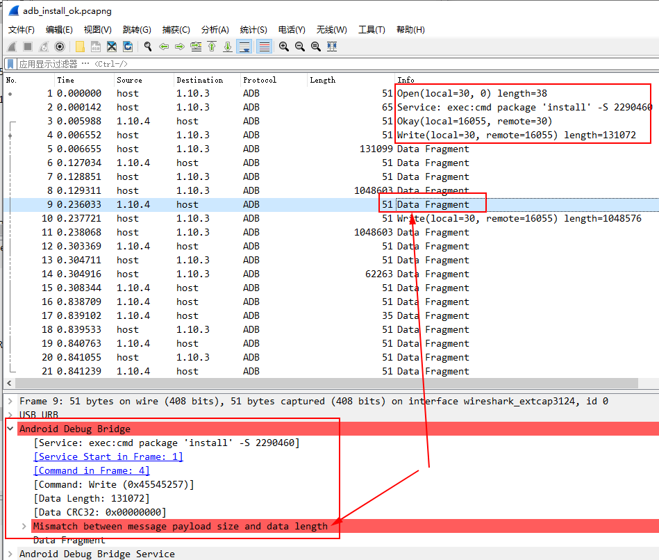
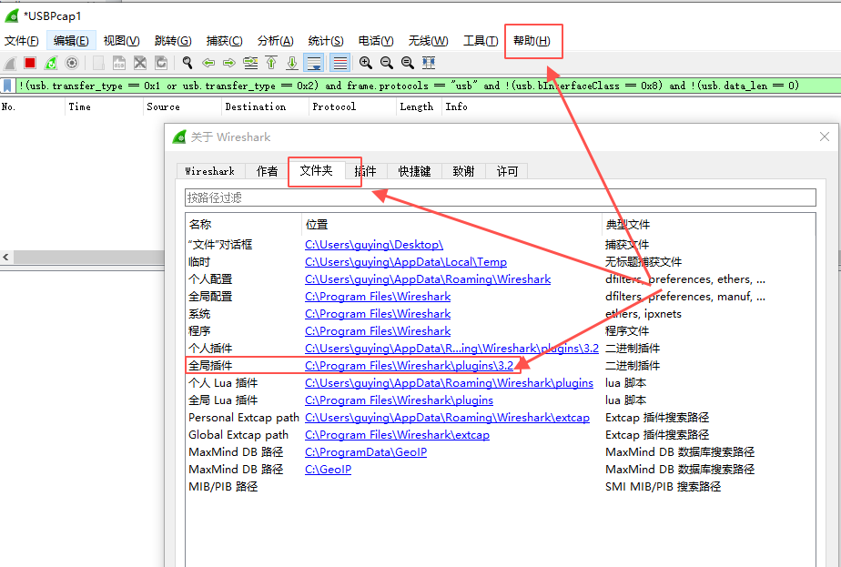
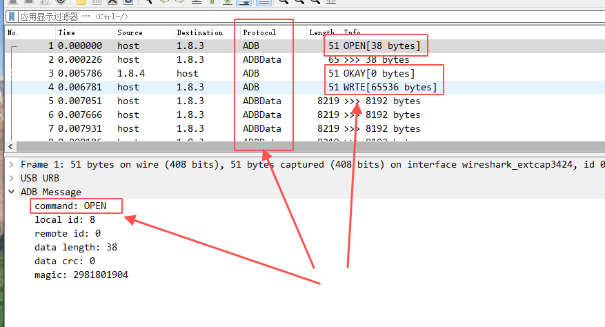
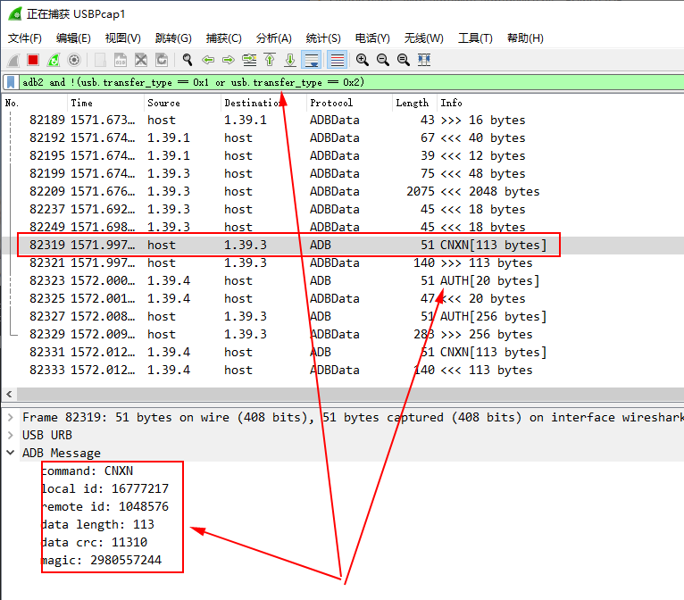

# ADB Dissector Plugin

## Backgroud

I'm working on a tool related with ADB, and I need to troubleshot a data transferring issue with WireShark.  Firstly I decoded the binary data manually and found it was too tedious and not quite straight to view. So

 I decided to make a new plugin to parse ADB messages.

It was when I almost finished my plugin and got some useful information that I found WireShark has built-in  support for ADB protocol. But after a few trials I return to my own plugin again:

* built-in parsing does not support real-time displaying(or maybe I need more settings?)

* built-in parsing organizes some strange information together while makes no sense for me

  * I need traffic transferring detail bytes
  * I believe the following mismatch is a bug that the built-in plugin tries to match the data length and length field of the confirm OKAY packet by wrong

  

## Usage

* Open WireShark "AboutBox" from menu "Help"

* Swith to "Directories" tab indicates by following picture(depending on your local language):

  

* Get plugin directory and put the adb.lua into it

* Restart WireShark or using "Ctrl + Shift + L"  to reload lua scripts

* Check the packet details  for a tree item named "ADB Message" like below:

  

* Filter adb traffic by `adb2 and !(usb.transfer_type == 0x1 or usb.transfer_type == 0x2)`, and the captured traffic should be like this:

  

